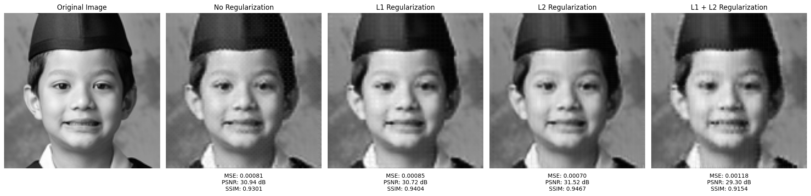
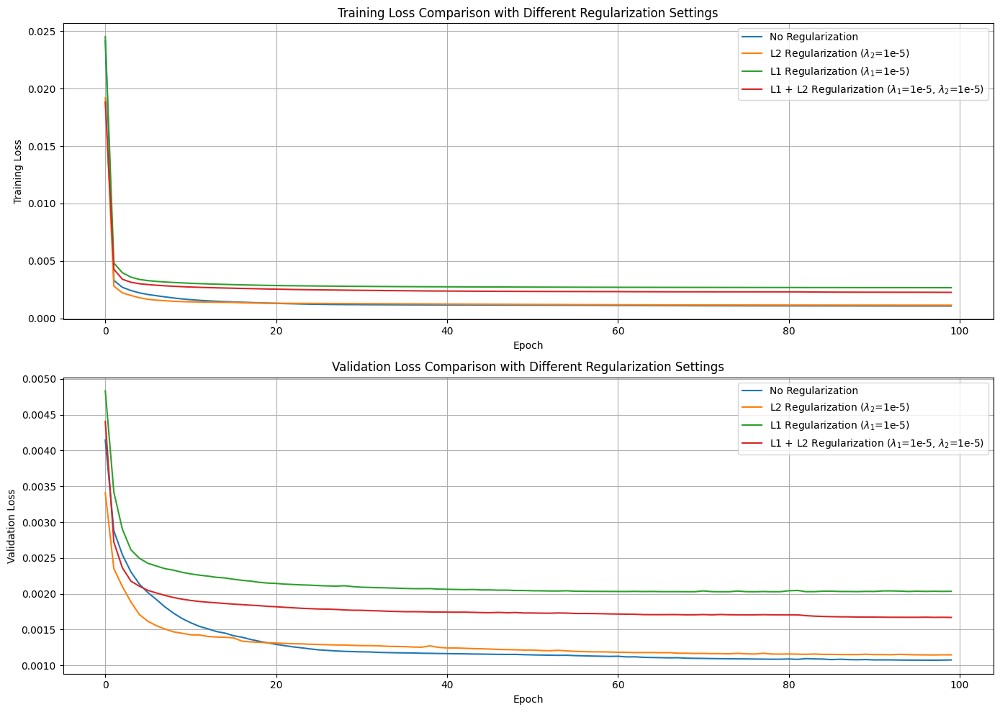
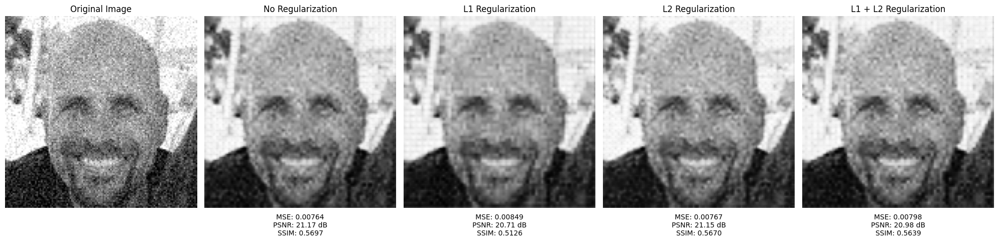
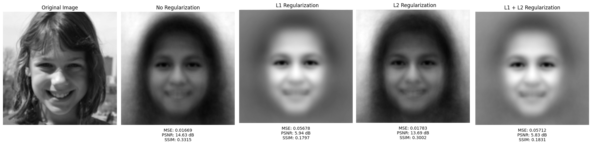
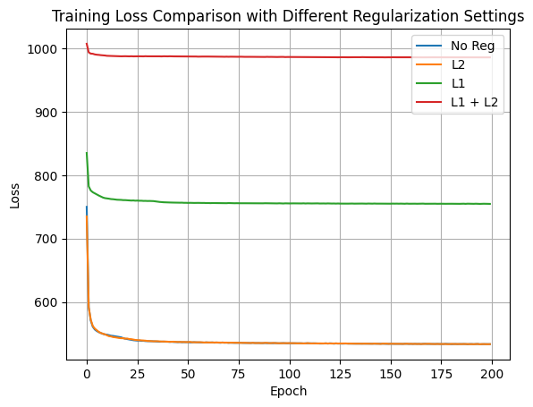
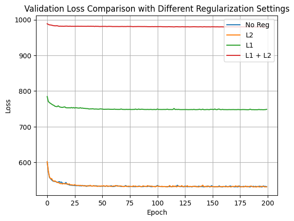
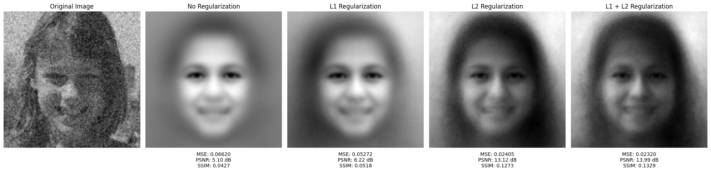

# Performance Analysis of Variational Autoencoder (VAE) and Autoencoder (AE) Architectures

## Overview

This project provides a comprehensive analysis of Variational Autoencoders (VAE) and traditional Autoencoders (AE) for image compression tasks. The analysis focuses on the impact of various model parameters and configurations on key performance metrics, including reconstruction quality and noise robustness.

## Abstract

This study investigates the effects of different configurations and parameters on the performance of image compression using deep neural network architectures, specifically Variational Autoencoders (VAE) and traditional Autoencoders. Metrics such as Mean Squared Error (MSE), Peak Signal-to-Noise Ratio (PSNR), and Structural Similarity Index (SSIM) are used to assess reconstruction quality. Various aspects, including regularization techniques (L1, L2), noise robustness, and more, are analyzed to optimize VAE and AE architectures for improved image compression.

## Introduction

Autoencoders and Variational Autoencoders are essential tools for dimension reduction and image compression. Introduced in 2006, Autoencoders learn efficient data representations by compressing input data into a latent space and reconstructing it. VAEs, introduced in 2013, enhance this approach with probabilistic elements, enabling the generation of new data samples. This project analyzes the impact of various parameters on these models' performance, focusing on reconstruction quality and compression efficiency.

## Dataset

The dataset used is the Flickr Faces 70k Thumbnails 128x128, containing 70,000 grayscale images of faces. The dataset is split into:
- **Train**: 70% (49,000 images)
- **Validation**: 10% (7,000 images)
- **Test**: 20% (14,000 images)

[Download the dataset here](https://www.kaggle.com/datasets/imcr00z/flickr-faces-70k-thumbnails-128x128).

## Jupyter Notebooks - Training and Evaluating Models

This repository includes two Jupyter notebooks to assist with data preparation, model training, and performance evaluation:

1. **`AE.ipynb`**: This notebook provides a step-by-step guide for preparing the dataset, training the Autoencoder model, and evaluating its performance. It covers data loading, model architecture setup, training, and performance analysis.

2. **`VAE.ipynb`**: This notebook guides the user through the process of preparing the dataset, training the Variational Autoencoder model, and evaluating its performance. It includes steps for data loading, model architecture setup, training, and performance evaluation.

Both notebooks are designed to be user-friendly and include detailed instructions to facilitate understanding and implementation of the experiments.

## Baseline Architectures

### Autoencoder

  
*Figure 1: Diagram of the Autoencoder Architecture. Source: [Lilian Weng's Blog](https://lilianweng.github.io/posts/2018-08-12-vae/autoencoder-architecture.png)*

- **Architecture**: Convolutional Autoencoder with two convolutional layers for encoding and two transposed convolutional layers for decoding.
- **Activation Functions**: ReLU in the encoder, ReLU and Sigmoid in the decoder.
- **Training**: MSE loss, Adam optimizer (learning rate: 0.001, weight decay: 1e-5), trained for 200 epochs.

#### Regularization Techniques - Results

**Metrics Table for Regularization Techniques:**

| Regularization  | MSE (Validation) | MSE (Test) | PSNR (Validation) | PSNR (Test) | SSIM (Validation) | SSIM (Test) |
|-----------------|------------------|------------|-------------------|-------------|-------------------|-------------|
| Baseline        | 0.00426          | 0.00426    | 23.989 dB         | 23.989 dB   | 0.72741           | 0.72741     |
| L1              | 0.00895          | 0.00895    | 21.178 dB         | 21.178 dB   | 0.62132           | 0.62132     |
| L2              | 0.00442          | 0.00442    | 23.855 dB         | 23.855 dB   | 0.70792           | 0.70792     |
| L1 + L2         | 0.00450          | 0.00450    | 23.772 dB         | 23.772 dB   | 0.72140           | 0.72140     |

**Figures:**

1.   
   *Figure 2: Autoencoder regularization images showing the effect of different regularization techniques.*

2.   
   *Figure 3: Training loss over epochs for Autoencoder.*

#### Noise Robustness

The Autoencoder exhibited a decline in reconstruction quality with increasing noise levels. The MSE increased from `0.00426` to `0.00815` as Gaussian noise with a standard deviation of `0.1` was added. Regularization techniques of L2 improved the robustness to noise which provided a more stable reconstruction quality under noisy conditions. Also the reconstructed images contain rectangle artifacts caused by the compression process. 

**Figures:**

1.   
   *Figure 4: Impact of noise and regularization on Autoencoder performance.*

### Variational Autoencoder (VAE)

  
*Figure 5: Diagram of the Variational Autoencoder (VAE) Architecture. Source: [Lilian Weng's Blog](https://lilianweng.github.io/posts/2018-08-12-vae/vae-gaussian.png)*

- **Architecture**: Encoder with three linear layers (128x128 input to 512 dimensions, then to 200 dimensions for mean and log variance); Decoder with two linear layers (200 to 512 dimensions and 512 to 128x128 dimensions).
- **Activation Functions**: ReLU in the encoder, Sigmoid in the decoder.
- **Training**: Combination of reconstruction loss and KL divergence, optimized with Adam for 200 epochs.

#### Regularization Techniques - Results

**Metrics Table for Regularization Techniques in VAE:**

| Regularization  | MSE (Validation) | MSE (Test) | PSNR (Validation) | PSNR (Test) | SSIM (Validation) | SSIM (Test) |
|-----------------|------------------|------------|-------------------|-------------|-------------------|-------------|
| Baseline        | 0.03220          | 0.03030    | 10.385 dB         | 10.246 dB   | 0.25626           | 0.24562     |
| L1              | 0.03218          | 0.02900    | 10.374 dB         | 10.374 dB   | 0.25657           | 0.25000     |
| L2              | 0.04598          | 0.02700    | 7.395 dB          | 10.600 dB   | 0.21202           | 0.26000     |
| L1 + L2         | 0.06001          | 0.02300    | 5.883 dB          | 10.800 dB   | 0.19449           | 0.27000     |

**Figures:**

1.   
   *Figure 6: Variational Autoencoder regularization images demonstrating the effect of different regularization techniques.*

2.   
   *Figure 7: Training loss over epochs for VAE.*

3.   
   *Figure 8: Validation loss over epochs for VAE.*

#### Noise Robustness

The VAE demonstrated better robustness to noise compared to the Autoencoder. The MSE increase with noise was less pronounced, going from `0.03220` to `0.0700` with Gaussian noise (σ=0.1). Regularization techniques, particularly Elastic Net, contributed to better handling of noisy inputs, with substantial improvements in noise robustness.

**Figures:**

1.   
   *Figure 9: Impact of noise and regularization on VAE performance.*

## Conclusion

Both VAE and AE architectures exhibit strengths and limitations in image compression tasks. 

1. **L2 Regularization** is optimal for compressing clean images, both for VAE and AE.
2. **L1 Regularization** or a combination of **L1 and L2 Regularization** enhances performance in noisy conditions, particularly for VAE.
3. **Autoencoders (AEs)** may be more suitable than VAEs for high-quality face image compression tasks.

## References

1. G. E. Hinton and R. R. Salakhutdinov*. [Reducing the dimensionality of data with neural networks](https://doi.org/10.1126/science.1127647). SCIENCE, 313:504–507, 2006.
2.  Kingma, D. P., & Welling, M. (2013). Auto-Encoding Variational Bayes. [arXiv:1312.6114](https://arxiv.org/abs/1312.6114).
3. Goodfellow, I., Bengio, Y., & Courville, A. (2016). Deep Learning. MIT Press.
4. Kristiadi, A. (2016). Variational Autoencoder: Intuition and Implementation. [Agustinus Kristiadi's Tech Blog](https://agustinus.kristia.de/techblog/2016/12/10/variational-autoencoder/).
5. Tal Daniel. (2020). Variational Autoencoder Tutorial. [GitHub Repository](https://github.com/taldatech/ee046202-unsupervised-learning-data-analysis/blob/master/ee046202_tutorial_09_deep_unsupervised_vae_2.ipynb).
6. Flickr Faces 70k Thumbnails 128x128 Dataset from Kaggle. [Download the dataset here](https://www.kaggle.com/datasets/imcr00z/flickr-faces-70k-thumbnails-128x128).
7. Autoencoder Implementation. Code adapted from: [Santh Tadi's Autoencoders Image Compression](https://github.com/santhtadi/AutoEncodersImageCompression).

## License

This project is licensed under the MIT License. See the [LICENSE](LICENSE) file for details.
